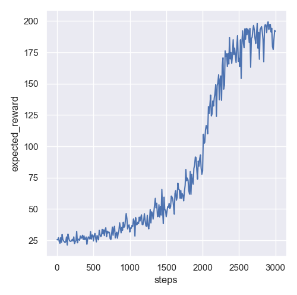

# Getting deeper into reinforcement learning.

Till now this repository contains some keras and torch code for q-learning and the policy algorithm for solving the cartpole challenge. 
It also provides code for the "on policy sampling" in torch.

# First Result 
The policy algorithm with "on policy sampling" takes long to converge and sample separate trajectories. But after some steps it was able to beat the challenge for some samples.

